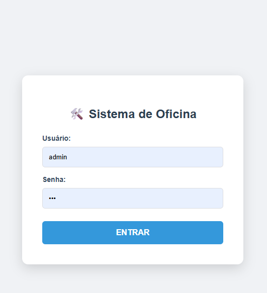
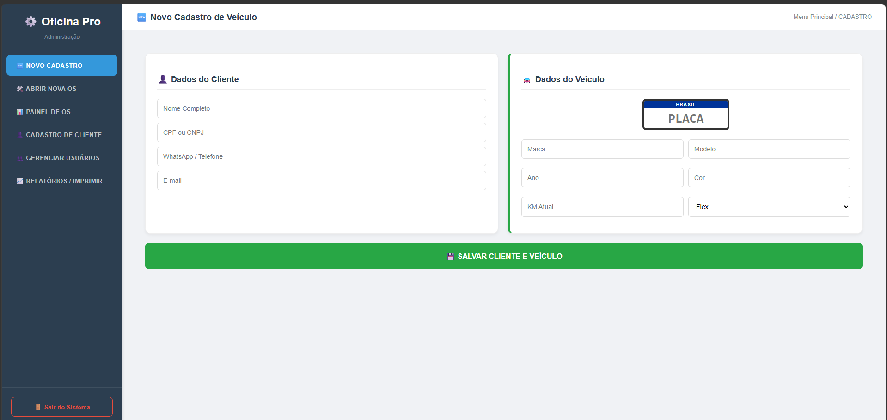
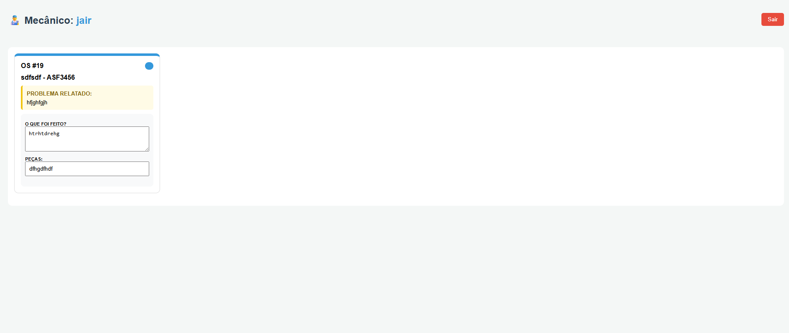
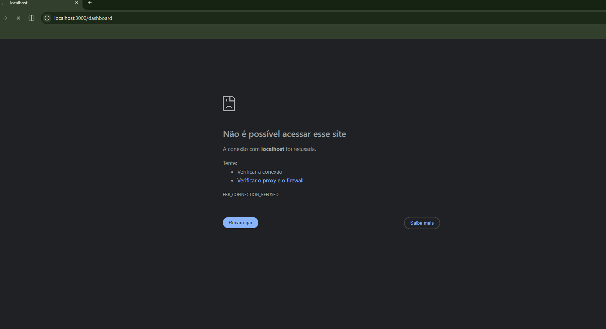

# Consolidação, Evidências Finais dos Testes Unitários e Revisão dos Incrementos

## 👥 Equipe
* Alexsander Davi Naves Olegário
* Edson Mateus Gonçalves
* Maria Lina da Silva
* Lucas de Jesus Gonçalves
* Pedro Otavio de Carvalho Nunes

---

## 1. Consolidação dos Testes: Autenticação e Controle de Acesso (Login)

Nesta etapa, a equipe consolidou os testes focados no comportamento do **Módulo de Login e Controle de Acesso Baseado em Níveis (RBAC)**. O objetivo foi garantir que o sistema identifique se o usuário é um Administrador ou um Mecânico, gerencie a sessão com segurança e redirecione cada um para a sua respectiva tela de trabalho.

### Resumo do Painel de Testes (Módulo de Autenticação)
* **Testes Planejados:** 3
* **Testes Executados:** 3
* **Testes com Sucesso:** 3
* **Defeitos Encontrados:** 1 (Corrigido antes da homologação)

---

## 2. Evidências Finais dos Testes (Comportamento de Login e Níveis)

Abaixo estão descritas as comprovações técnicas do comportamento de login e segurança das contas:

### A. Validação de Autenticação e Redirecionamento (Frontend & Backend)
* **Comportamento do Perfil Administrador:** Ao inserir credenciais de Administrador, a API valida o token, e o React redireciona o usuário direto para o **Dashboard de Gestão Financeira**, liberando os botões de auditoria e filtros gerais.
* **Comportamento do Perfil Mecânico:** Ao inserir credenciais de Mecânico, o sistema realiza o login e redireciona o usuário direto para a **Tela de Execução do Pátio**, exibindo apenas as Ordens de Serviço sob sua responsabilidade e ocultando dados financeiros da oficina.

### B. Validação de Segurança e Proteção de Rotas
* **Bloqueio de Usuários Não Autenticados:** Tentativas de acessar a URL do Dashboard diretamente pelo navegador (ex: `/dashboard`) sem fazer login são interceptadas pelo React, que limpa a sessão e força o usuário a voltar para a tela de `/login`.
* **Proteção de Endpoints na API (JWT):** Validou-se que as rotas do backend exigem o token de autenticação correspondente. Um token de mecânico que tenta disparar uma requisição para uma rota exclusiva de administrador recebe o código `403 Forbidden`.

---

## 3. Galeria de Evidências Visuais

Abaixo estão anexados os prints que comprovam a execução real dos testes descritos acima:

**1. Interface Geral da Tela de Login**

**2. Ambiente Redirecionado para o Perfil Administrador**

**3. Ambiente Redirecionado para o Perfil Mecânico**

**4. Interceptação de Segurança e Bloqueio de Rota Não Autenticada**

---

## 4. Revisão dos Incrementos (O que foi entregue)

Ao final desta iteração, a equipe homologou os seguintes comportamentos do sistema:

1. **Tela de Login Unificada:** Interface em React com tratamento de erros para senhas incorretas ou usuários inexistentes.
2. **Distribuição de Papéis (Roles):** Separação lógica no banco de dados (`MySQL`) identificando as permissões de cada perfil de funcionário.
3. **Redirecionamento Inteligente:** Experiência de usuário fluida que joga cada colaborador exatamente na interface necessária para o seu trabalho cotidiano.

---

## 5. Conclusão da Sprint

O incremento do módulo de autenticação e controle de acessos foi considerado aprovado. Com o login do administrador e do mecânico funcionando corretamente e as rotas protegidas de acordo com o nível de acesso de cada usuário, o sistema garante a segurança necessária para as próximas fases de faturamento e manipulação de dados sensíveis. Além disso, os testes realizados demonstraram que o processo de autenticação está estável, confiável e alinhado aos requisitos definidos pela equipe. A correção dos problemas identificados durante a fase de testes contribuiu para aumentar a robustez da solução, reduzindo riscos de acesso indevido e falhas de segurança. Dessa forma, o incremento está validado e pronto para servir de base para a implementação das próximas funcionalidades do projeto.
