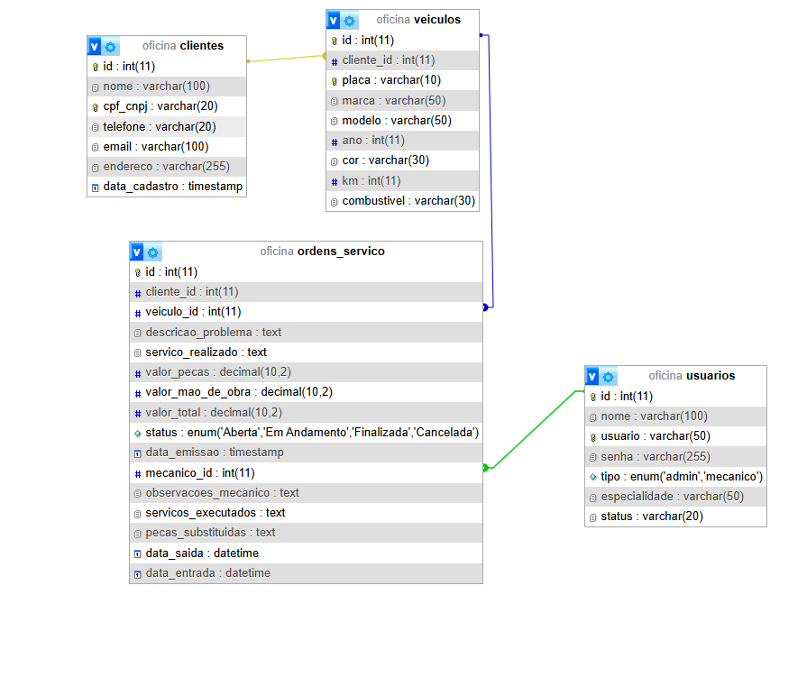
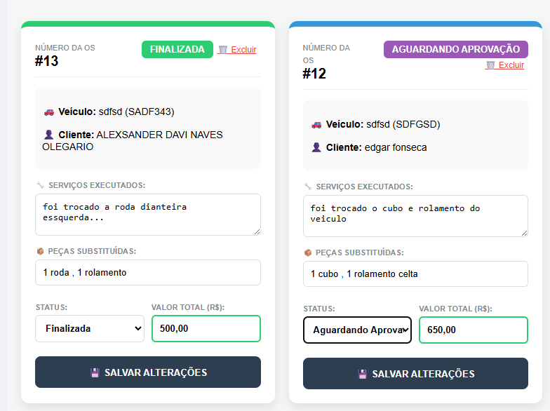

# Sprint 3 – Modelagem do Sistema

## 👥 Alunos
* ALEXSANDER DAVI NAVES OLEGÁRIO (Líder)
* EDSON MATEUS GONÇALVES
* MARIA LINA DA SILVA
* LUCAS DE JESUS GONÇALVES
* PEDRO OTAVIO DE CARVALHO NUNES

## 1. Objetivo
Representar a solução "Oficina 2.0" por meio de modelos técnicos que auxiliem a compreensão do fluxo de Ordens de Serviço (OS) e apoiem as decisões de desenvolvimento front-end e back-end, focando na transição de status e integridade dos dados.

## 2. Visão Geral do Sistema
O sistema é uma aplicação web voltada para a gestão de oficinas mecânicas. Ele separa as responsabilidades entre o técnico (Mecânico), que realiza o laudo, e o gestor (Administrador), que valida o serviço e realiza o fechamento financeiro.

---

## 3. Modelos Produzidos

### 3.1. Modelo de Dados (MER)
Representa a arquitetura do banco de dados MySQL, demonstrando o relacionamento entre as tabelas de usuários, veículos e ordens de serviço.

### 3.2. Protótipo de Interface
Representa o front-end em React, destacando a visualização das OS com status "Aguardando Aprovação" (identificadas pela cor roxa no sistema).

### 3.3. Diagrama de Transição de Estados (Opcional/Adicional)
Este modelo detalha o ciclo de vida de uma Ordem de Serviço dentro do sistema, garantindo que o fluxo de aprovação seja respeitado.

* **Fluxo:** Aberta ➔ Em Andamento ➔ Aguardando Aprovação (Revisão) ➔ Finalizada.
* **Regra:** Uma OS não pode saltar de "Em Andamento" direto para "Finalizada" sem passar pela revisão administrativa.
---

## 4. Relação entre Requisitos e Modelos

| Requisito | Modelo Relacionado | Justificativa |
|---|---|---|
| **RF01:** Alteração para "Aguardando Aprovação" | Protótipo de Interface | Valida a interação do usuário com a nova regra de negócio visual. |
| **RF02:** Persistência de peças e serviços | Modelo de Dados (MER) | Garante a integridade e persistência das informações no MySQL. |
| **RF03:** Dashboard do Administrador | Protótipo / Casos de Uso | Demonstra a visão do gestor para auditoria e filtros de status. |

---

## 5. Descrição Textual Complementar
* **Modelo de Dados:** Estruturado para suportar o histórico de manutenções, vinculando cada OS a um veículo e a um cliente específico, permitindo auditoria de quem executou o serviço.
* **Protótipo:** Focado em usabilidade, utiliza o código de cores para reduzir o erro humano, impedindo que o administrador esqueça de revisar serviços finalizados pelo pátio.

---

## 6. Refinamento do Backlog
Após a modelagem, a história de usuário principal foi detalhada:
* **Item original:** "Como mecânico, quero finalizar a OS".
* **Item refinado:** "Como mecânico, quero enviar a OS para aprovação, para que o administrador revise as peças utilizadas e defina o valor final, garantindo o status intermediário de 'Aguardando Aprovação'."

---

## 7. Revisão da Sprint
* **O que foi concluído:** Estruturação do banco de dados MySQL, criação das rotas de status no Node.js e integração visual no React.
* **Decisões tomadas:** Uso da cor roxa para diferenciar estados pendentes de revisão administrativa.
* **Dificuldades:** Sincronização dos estados do banco com a atualização em tempo real do dashboard.
* **Próximos passos:** Implementar módulo de fechamento financeiro e geração de relatório para o cliente.
